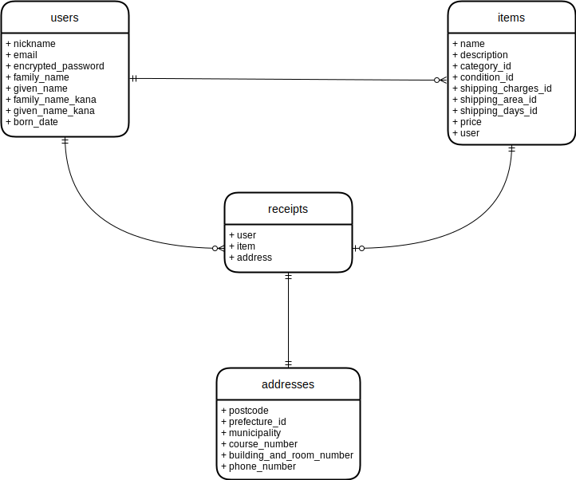

# FURIMA DataBase-design

## users-table
|Column            |Type   |Options                               |
|------------------|-------|--------------------------------------|
|nickname          |string |null: false, unique: true, index: true|
|email             |string |null: false, unique: true, index: true|
|encrypted_password|string |null: false                           |
|family_name       |string |null: false                           |
|given_name        |string |null: false                           |
|family_name_kana  |string |null: false                           |
|given_name_kana   |string |null: false                           |
|born_year_id      |integer|null: false                           |
|born_month_id     |integer|null: false                           |
|born_day_id       |integer|null: false                           |

### Association
- has_many :items
- has_many :receipts

## items-table
|Column             |Type      |Options                       |
|-------------------|----------|------------------------------|
|name               |string    |null: false                   |
|description        |text      |null: false                   |
|category_id        |integer   |null: false                   |
|condition_id       |integer   |null: false                   |
|shipping_charges_id|integer   |null: false                   |
|shipping_area_id   |integer   |null: false                   |
|shipping_days_id   |integer   |null: false                   |
|price              |integer   |null: false                   |
|user               |references|null: false, foreign_key: true|

### Association
- belongs_to :user
- has_one :receipt

## receipts-table
|Column |Type      |Options                                     |
|-------|----------|--------------------------------------------|
|user   |references|null: false, foreign_key: true              |
|item   |references|null: false, unique: true, foreign_key: true|
|address|references|null: false, unique: true, foreign_key: true|

### Association
- belongs_to :user
- belongs_to :item
- belongs_to :address

## addresses-table
|Column                  |Type   |Options    |
|------------------------|-------|-----------|
|postcode                |string |null: false|
|prefecture_id           |integer|null: false|
|municipality            |string |null: false|
|course_number           |string |null: false|
|building_and_room_number|string |           |
|phone_number            |string |null: false|

### Association
- has_one :receipt

## ER-diagram

